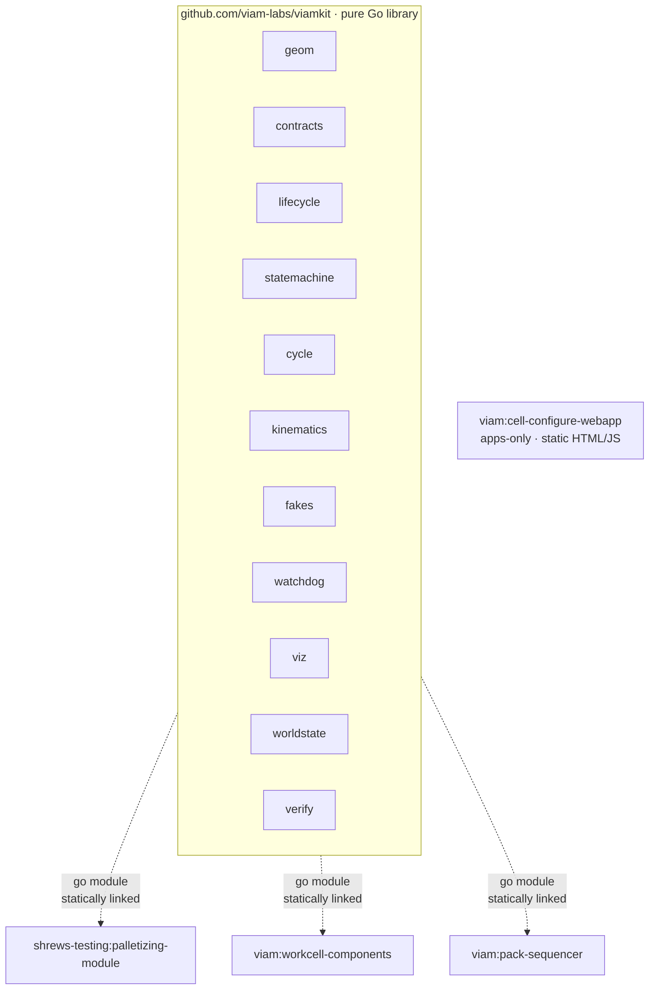
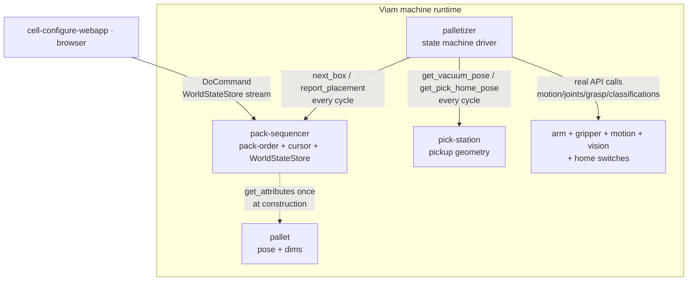

# Module ecosystem

The workcell ecosystem is five repos and one Viam machine. This document
maps how they fit together at build time and at runtime.

## Build-time dependencies

viamkit is a pure Go library. The three Viam modules import it via
standard `go.mod` requires; the library is statically linked into each
module's tarball at build time.

```
                   github.com/viam-labs/viamkit (library)
              ┌──────┬──────────┬──────────┬─────────────┐
              │ geom │ contracts│ lifecycle│ statemachine│
              ├──────┼──────────┼──────────┼─────────────┤
              │cycle │kinematics│   fakes  │   watchdog  │
              ├──────┼──────────┼──────────┼─────────────┤
              │  viz │worldstate│  verify  │             │
              └──────┴──────────┴──────────┴─────────────┘
                              │  go module
              ┌───────────────┼───────────────┐
              ▼               ▼               ▼
   ┌─────────────────┐ ┌──────────────┐ ┌────────────────────┐
   │ viam:workcell-  │ │ viam:pack-   │ │ shrews-testing:    │
   │ components      │ │ sequencer    │ │ palletizing-module │
   └─────────────────┘ └──────────────┘ └────────────────────┘

   viam:cell-configure-webapp — apps-only, no Go dependency on viamkit.
```



## Runtime DoCommand flow

Once installed on a Viam machine, the modules talk to each other via
DoCommand. The palletizer is the active driver — it reads from
pack-sequencer and pick-station every cycle. The webapp is an
observer + operator-control surface.

```
            ┌───────────────────────────────────────────────────┐
            │  cell-configure-webapp  (in browser)              │
            │  control panel · 3D scene · verify · status poll  │
            └─────────────────────────┬─────────────────────────┘
                                      │
                            DoCommand │
                            + WorldStateStore stream
                                      │
                                      ▼
   ┌────────────────────────────────────────────────────────────┐
   │  pack-sequencer (worldstatestore service)                  │
   │   · pack-order math (column, interlock)                    │
   │   · cursor: next_seq, done / failed / skipped              │
   │   · per-cycle world-frame place poses                      │
   │   · live Transform stream for the 3D scene                 │
   │                                                            │
   │  DoCommand verbs (typed via viamkit/contracts):            │
   │    next_box ◀──── every cycle ─────────────┐               │
   │    report_placement ◀── every cycle ─────┐ │               │
   │    get_box_dims ◀── once at construction │ │               │
   │    get_pallet_home / get_pack_order ◀────┤ │               │
   │    get_progress / set_box_transform ◀────┤ │               │
   │    reset_cursor ◀────────────────────────┘ │               │
   └─────────────────┬──────────────────────────┼───────────────┘
                     │                          │
                     │ DoCommand                │
              (once at construction)            │
                     ▼                          │
   ┌────────────────────────────┐               │
   │  pallet (generic component)│               │
   │  · pose + dims from frame  │               │
   │  · get_attributes / get_pose                │
   └────────────────────────────┘               │
                                                │
                                                │ DoCommand
                                                │ (every cycle)
                                                │
   ┌────────────────────────────────────────────┴──────────────┐
   │  palletizer (generic component) — state machine driver   │
   │                                                          │
   │  Drives via real-API calls (NOT DoCommand):              │
   │    · arm  (motion, joint positions, kinematics)          │
   │    · gripper (Grab, Open, IsHoldingSomething)            │
   │    · motion service (Move, GetPose)                      │
   │    · vision service (ClassificationsFromCamera)          │
   │    · home switches (SetPosition for replay)              │
   │                                                          │
   │  Reads pickup geometry via DoCommand:                    │
   └─────────────────┬────────────────────────────────────────┘
                     │
                     │ DoCommand (every cycle)
                     ▼
   ┌────────────────────────────────────┐
   │  pick-station (generic component)  │
   │   · get_vacuum_pose                │
   │   · get_pick_home_pose             │
   │   · pose + dims from frame         │
   └────────────────────────────────────┘
```



## Who owns what state

A clean separation is one of the system's strengths. Each piece of
mutable state has exactly one owner:

| State | Owner | Lifetime |
|---|---|---|
| Pallet pose + dimensions | `pallet` (frame system) | Per-machine config |
| Pick-station pose + dimensions | `pick-station` (frame system) | Per-machine config |
| Box dimensions | `pack-sequencer` (Config) | Per-machine config |
| Pack order + cursor + done set | `pack-sequencer` (runtime) | Per-pallet |
| Per-placement world-frame pose | `pack-sequencer` (computed) | Per-cycle |
| Live placed-box Transforms | `pack-sequencer` (WorldStateStore) | Per-cycle |
| State-machine state | palletizer (`viamkit/statemachine`) | Per-cycle |
| Current grasp seq, holdingBox | palletizer | Per-cycle |
| Cycle timer + stats | palletizer (`viamkit/cycle`) | Per-cycle / lifetime |
| Loop / cleanup contexts | palletizer (`viamkit/lifecycle`) | Per-module |
| Operator UI state | webapp (client-side only) | Per-tab |
